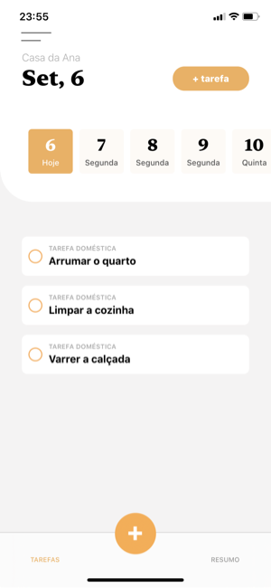

# Ninho

Este é o app **Ninho**, da equipe **Sovi**, submetido para o MegaHack Women 2020.

## O que é?

**Ninho** é uma plataforma para auxiliar na divisão de tarefas domésticas, **proporcionando uma visão geral de tudo que precisa ser feito** para que o local de convivência seja sempre muito agradável para todos.

## Features

- Lista de tarefas a serem realizadas
- Espaço dedicado à informação
- Visão geral do trabalho realizado por cada membro da casa (em breve)
- Relatório de gastos com supermercado (em breve)

## Para instalar

### Pelo TestFlight
Siga esse link para fazer download pelo [TestFlight](). Disponível para **iOS 13** ou superior.

### Pelo repositório do projeto
Faça download deste repositório e rode no simulador em **XCode 11.7** ou superior.

  
